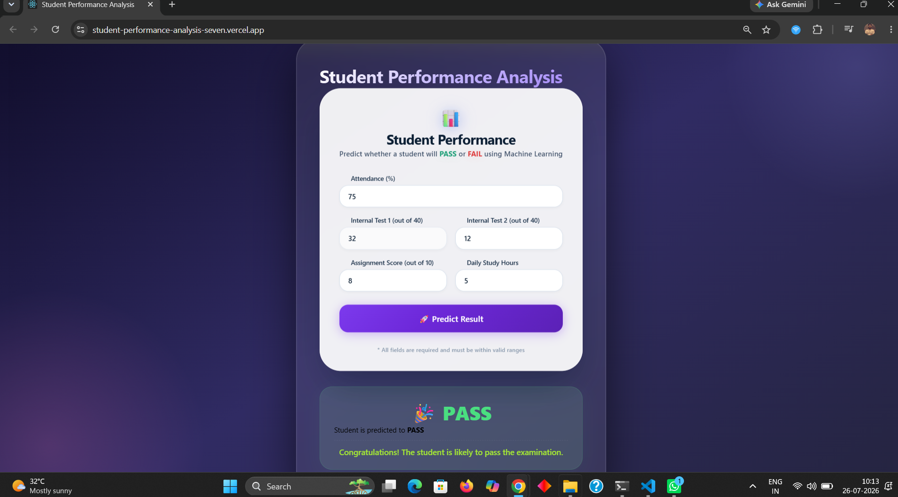

# 🎓 Student Performance Analysis

A full-stack Machine Learning web application that predicts whether a student is likely to **PASS** or **FAIL** based on academic performance. The application combines a trained Scikit-learn model with a Flask REST API and a React frontend to provide real-time predictions.

---

## 🚀 Live Demo

### 🌐 Frontend (Vercel)

https://student-performance-analysis-seven.vercel.app/

### ⚙️ Backend API (Render)

https://student-performance-analysis-yzgu.onrender.com/

---

## 📌 Features

- Predicts whether a student will **PASS** or **FAIL**
- Machine Learning model trained using Scikit-learn
- Flask REST API for prediction
- Modern React.js frontend
- Responsive and user-friendly interface
- Real-time prediction
- Fully deployed using Render and Vercel

---

## 🛠️ Tech Stack

### Frontend
- React.js
- Axios
- HTML5
- CSS3

### Backend
- Flask
- Flask-CORS
- Gunicorn

### Machine Learning
- Scikit-learn
- NumPy
- SciPy
- Joblib

### Deployment
- Render
- Vercel

### Version Control
- Git
- GitHub

---

# 📂 Project Structure

```
Student-Performance-Analysis
│
├── backend
│   ├── app.py
│   ├── model.pkl
│   ├── scaler.pkl
│   ├── Procfile
│   ├── requirements.txt
│   └── runtime.txt
│
└── frontend
    ├── package.json
    ├── public
    │     └── index.html
    │
    └── src
          ├── App.js
          ├── App.css
          ├── api.js
          ├── index.js
          │
          └── components
                ├── StudentForm.jsx
                └── Result.jsx
```

---

# ⚙️ Clone the Repository

```bash
git clone https://github.com/Sivakumar10036/Student-Performance-Analysis.git
```

Move into the project folder

```bash
cd Student-Performance-Analysis
```

---

# 🐍 Backend Setup

Move into backend

```bash
cd backend
```

## Create Virtual Environment

### Windows

```bash
python -m venv venv
```

Activate Virtual Environment

```bash
venv\Scripts\activate
```

### Linux / macOS

```bash
python3 -m venv venv
```

Activate

```bash
source venv/bin/activate
```

---

## Install Dependencies

```bash
pip install -r requirements.txt
```

---

## Run Backend

```bash
python app.py
```

Backend will run at

```
http://127.0.0.1:5000
```

---

# ⚛️ Frontend Setup

Open another terminal.

Move into frontend

```bash
cd frontend
```

Install dependencies

```bash
npm install
```

Run React application

```bash
npm start
```

Frontend will run at

```
http://localhost:3000
```

---

# 📡 API Endpoints

## Home Endpoint

### Request

```
GET /
```

### Response

```json
{
    "message":"Student Performance Analysis API Running Successfully"
}
```

---

## Prediction Endpoint

### Request

```
POST /predict
```

### Request Body

```json
{
    "attendance":90,
    "internal1":35,
    "internal2":34,
    "assignment":9,
    "studyhours":5
}
```

### Response

```json
{
    "prediction":"PASS"
}
```

---

# 📷 Screenshots


## Prediction Result



---

# 🚀 Deployment

## Backend

Platform

```
Render
```

URL

```
https://student-performance-analysis-yzgu.onrender.com/
```

---

## Frontend

Platform

```
Vercel
```

URL

```
https://student-performance-analysis-seven.vercel.app/
```

---

# 💻 How It Works

1. User enters student academic details.
2. React frontend sends the data to the Flask backend.
3. Flask loads the trained Machine Learning model.
4. The model predicts whether the student will PASS or FAIL.
5. The prediction is returned to the frontend.
6. React displays the result instantly.

---

# 📈 Future Enhancements

- Prediction confidence score
- Student login system
- Prediction history
- Database integration
- Admin dashboard
- Performance analytics
- Charts and visualizations
- Export prediction report as PDF

---


# 🤝 Contributing

Contributions are welcome!

1. Fork the repository.
2. Create a new branch.

```bash
git checkout -b feature-name
```

3. Commit your changes.

```bash
git commit -m "Add new feature"
```

4. Push your branch.

```bash
git push origin feature-name
```

5. Open a Pull Request.

---

# ⭐ Support

If you found this project helpful,

⭐ Star this repository on GitHub.

---


- Scikit-learn
- Flask
- React.js
- Render
- Vercel
- GitHub